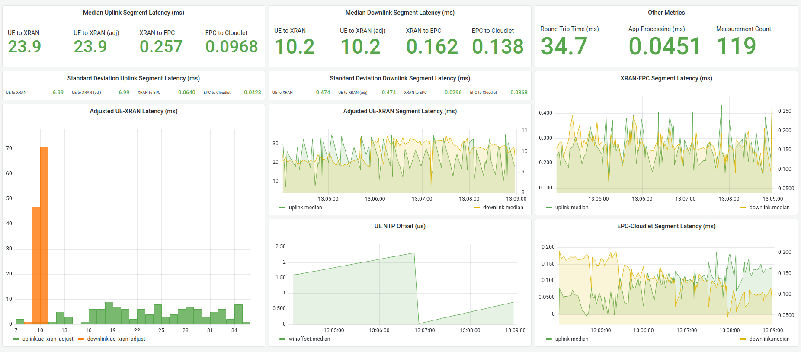

# NetworkLatencySegmentation

## Introduction
This repository contains the implementation of the Network Latency Segmentation project by Sophie Smith and Ishan Darwhekar in the CMU Mobile and Pervasive Computing 15-821/18-843 course. The project was mentored by Jim Blakley. The video and poster for the project are [here](https://www.cs.cmu.edu/~15-821/archive/#2021). A CMU Technical Report, *"Segmenting Latency in a Private 4G LTE Network"*, is available here<link when published>. This work and the code associated with it is very specific to the network used. As a result, this code will not be useable without modifications for different networks.

The aim of this project is to determine the latency of each segment in the round-trip path of the [Living Edge Lab](https://www.cmu.edu/scs/edgecomputing/index.html) network. To determine segment latency, we inserted probes into the network at the User Equipment (UE aka *laptop*), XRAN, EPC and the Cloudlet. Probes between the XRAN, EPC and Cloudlet were captured by an **Intra-CN** server, *"waterspout"*, that mirrored the ports between the systems.

The `processing` folder contains scripts to run for real-time segment latency analysis. The `preprocessing` folder contains the scripts used to collect and store latency measurements for preliminary experiments to analyze the effect of different factors on the segment latency. 

## Collecting Latency Measurements
We receive and inspect each incoming packet using [Pyshark](https://github.com/KimiNewt/pyshark), a Python wrapper for Wireshark. From this, we can extract fields necessary to correlate packets at each probe. 

We use the source and destination IP addresses to identify whether the packet is uplink or downlink and to determine which segment (UE-XRAN, XRAN-EPC, EPC-Cloudlet) they correspond to. To correlate ICMP data, we use the ICMP identifier and ICMP timestamp. To correlate the TCP data, we use the sequence number, TCP timestamp and acknowledgement number We use the differences in epoch time to calculate the segment latency. 

The scripts `cloudlet_measure.py`, `laptop_measure.py` and `waterspout_measure.py` handle extracting and storing these fields in an InfluxDB database. To run these scripts, run these commands on the Cloudlet, Waterspout, and the UE respectively:

```
sudo tcpdump -s 0 -U -w - -i enp179s0f1 | python3 cloudlet_measure.py

sudo tcpdump -s 0 -U -w - -i eno1 | python3 waterspout_measure.py

sudo tcpdump -s 0 -U -w - -i enx0016083656d3 | python3 laptop_measure.py
```

The interface names will be specific to the network used.

Note that adding ```not tcp and not sctp``` to the *tcpdump* command helps to filter out the overwhelming amount of  TCP and SCTP traffic that is spurious if you're only interested in ICMP ping data.

## Latency Segmentation Calculations
We use the `query_measurements.py` script to calculate segment latency from extracted fields for each probe and upload them to a separate database. The commands to run this script are: 

```
python3 query_measurements.py 
```

## InfluxDB
To store all values above, InfluxDB must be running on the Cloudlet. The Cloudlet is the location where all databases are stored. To run InfluxDB, run the following command on the Cloudlet:

```
docker run -it -p 8086:8086 -v influxdb:/var/lib/influxdb influxdb:1.8
```

## Grafana Dashboard
To enable the grafana dashboard, grafana must be running on the Cloudlet. To run Grafana, run the following command on the Cloudlet:

```
docker run -d -p 3000:3000 grafana/grafana-enterprise
```
Connect to grafana at http://localhost:3000/, login with admin, pw=admin, and import processing `dashboard.json` or one of the other dashboards in the grafana folder. Within grafana, add a datasource for InfluxDB. In the datasource, use the IP or domain name of the Cloudlet, not *localhost*. Now, edit each of the panels in the dashboard to use that datasource. Even though the InfluxDB datasource is the default in the imported json, you need to reconnect the datasource to the dashboard for it to access the data.

An example of the *Network Latency Segmentation Summary* dashboard is below.


# OpenRTiST
To run experiments with OpenRTiST (https://github.com/cmusatyalab/openrtist), for TCP measurements, run the following command on the cloudlet:

```
docker run --rm -it -p 9099:9099 cmusatyalab/openrtist:stable
```
# TODO

- [ ] Instructions for configuring multitech dongle on the UE
- [ ] Rename *laptop* to *ue*
- [x] How to get the interface names for waterspout, laptop, and cloudlet
- [ ] Setting up chrony and offsets
- [ ] 
